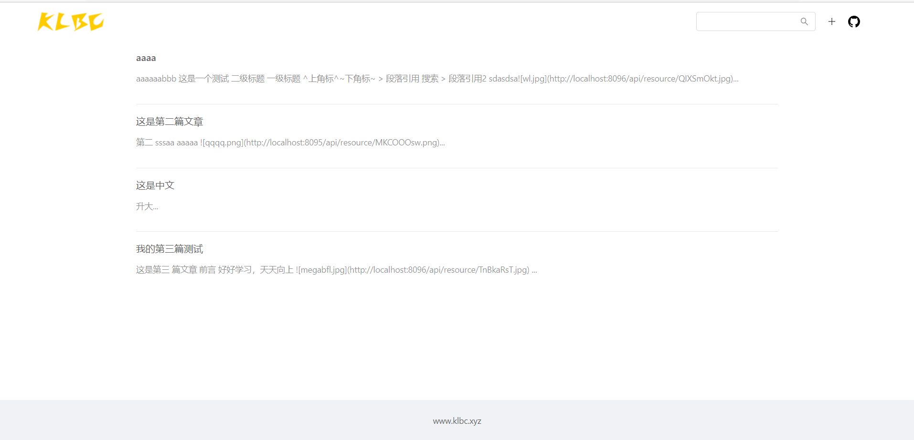
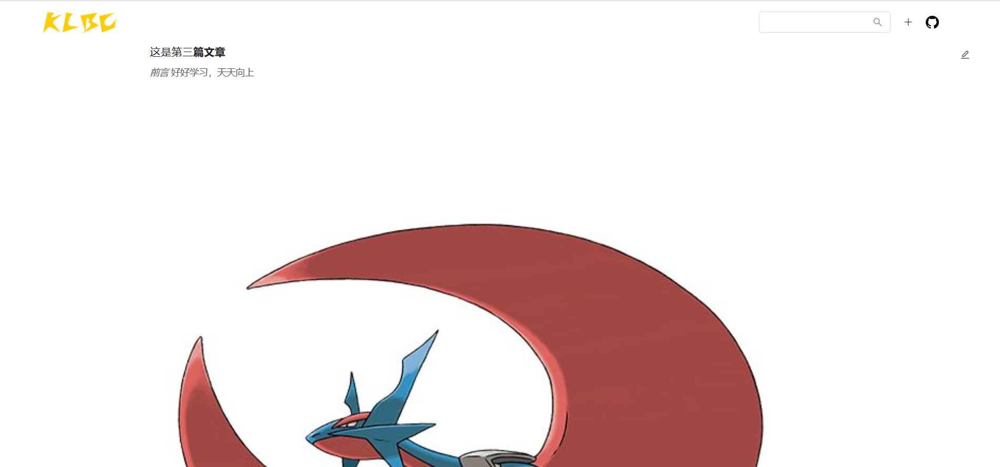

# klbc.xyz

## 设计初衷

开发该个人博客网站，主要是为了记录工作或学习中的一些个人笔记，便于以后出现问题可以快速定位；
留下一些个人学习记录。会慢慢完善。

## 总体预览






### 技术实现

    springboot 2.4.5
    MySQL 8.0
    MybatisPlus 3.4.3
    gradle 7.1.1
    vue 2.6.11
    antd 1.7.7
    marked 2.0.7 
    mavon-editor 2.9.1

### 更新日志

#### 1.0.0

1. 【新增】博客首页，分页渲染博客列表
2. 【新增】查看博客详情
3. 【新增】临时推荐文档，书籍；捐赠支持功能
4. 【新增】 支持博客编辑，必须是登录后才能修改


### 项目启动

前端 （front-end）

```
npm install

npm run serve
```

后台 （back-end）

开发启动

```shell
java -jar -Dspring.profiles.active=dev back-end.jar 
```

### 部署

前端

```shell
scp -i ~/.ssh/id_rsa -r /Users/noodzhan/IdeaProjects/noodb/front-end/dist ubuntu@1.15.231.74:/home/ubuntu/nblog/front-end
```

后台

```shell

scp -i ~/.ssh/id_rsa /Users/noodzhan/IdeaProjects/noodb/back-end/build/libs/back-end-1.0.0.jar ubuntu@1.15.231.74:/home/ubuntu/nblog/noodb-blog-jar

```
